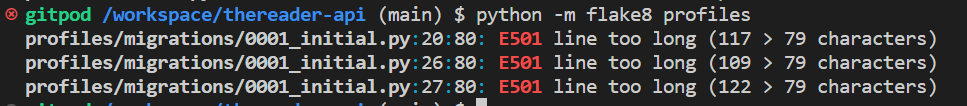

# **Testing**

This page includes the backend testing of the Reader application.

## **Unit Testing**

I tested the functionality with unit tests for each app, they all pass.

### **Custom Models**

- [bookclubevents tests](bookclubevents/tests.py)

- [bookofthemonth tests](bookofthemonth/tests.py)

- [responses tests](responses/tests.py)

### **Basic Models**

- [comments tests](comments/tests.py)

- [followers tests](followers/tests.py)

- [likes tests](likes/tests.py)

- [posts tests](posts/tests.py)

- [profiles tests](profiles/tests.py)

### **Frontend**

The frontend testing is available [here](https://github.com/vivienrauch/thereader/blob/main/TESTING.md)

## **Code Validation**

### Python validation using Flake8

- **Book Club Events**

- **Book Of The Month**

- **Responses**

- **Profiles**

- **Posts**

- **Likes**

- **Comments**

- **Followers**

# **Bugs**

- Fixed: One of the bugs was a missing backslash that was keeping the signin form to render properly.

